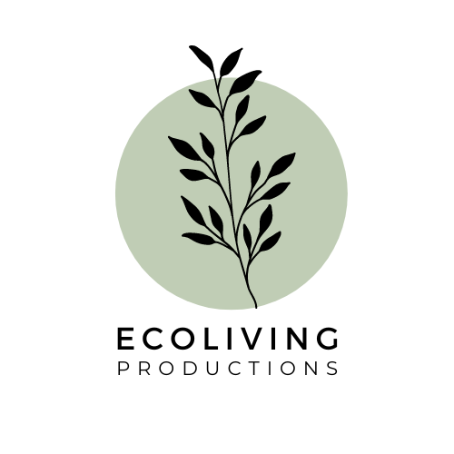

# Ecoliving Productions  

Ecoliving Productions es un proyecto desarrollado como parte de un trabajo académico en la carrera de Ingeniería Informática. Este proyecto simula una tienda en línea especializada en la venta de muebles inteligentes y ecológicos.

## Descripción del Proyecto

El proyecto se enfoca en implementar una plataforma web que permite a los usuarios explorar y comprar muebles ecológicos inteligentes. Entre las funcionalidades principales se incluyen:

- **Lógica con PHP y MySQL**: Utiliza PHP para la implementación del backend y MySQL a través de XAMPP para la gestión de la base de datos de productos, usuarios y pedidos.

- **Página Web Dinámica**: La interfaz de usuario se desarrolla utilizando HTML y CSS para crear una experiencia interactiva y amigable.

- **Base de Datos con XAMPP**: Se emplea XAMPP para el entorno de desarrollo local, gestionando la base de datos MySQL donde se almacenan los productos, usuarios registrados y detalles de pedidos.

## Tecnologías Utilizadas

- **PHP**: Para la lógica del servidor y la interacción con la base de datos.
- **MySQL (XAMPP)**: Como sistema de gestión de base de datos relacional.
- **HTML/CSS**: Para el desarrollo de la interfaz de usuario y la experiencia del cliente en la web.
- **XAMPP**: Para la creación de un entorno local de servidor web y base de datos.

## Contribuidores

Este proyecto fue desarrollado en colaboración por mi y cuatro compañeros mios de Ingeniería Informática. Cada miembro del equipo contribuyó con el diseño, implementación y documentación del proyecto.

## Video Demostrativo

A continuación se muestra una miniatura del video demostrativo de la app. Haz clic en la imagen para ver el video en YouTube.

<p align="center">
  <a href="https://youtu.be/Pm8fDxdXCa0">
    
  </a>
</p>

```plaintext
All Rights Reserved
Copyright (c) 2024 Willy

Unauthorized copying of this file, via any medium is strictly prohibited.
Proprietary and confidential.

Written by Wistry, 2024.
